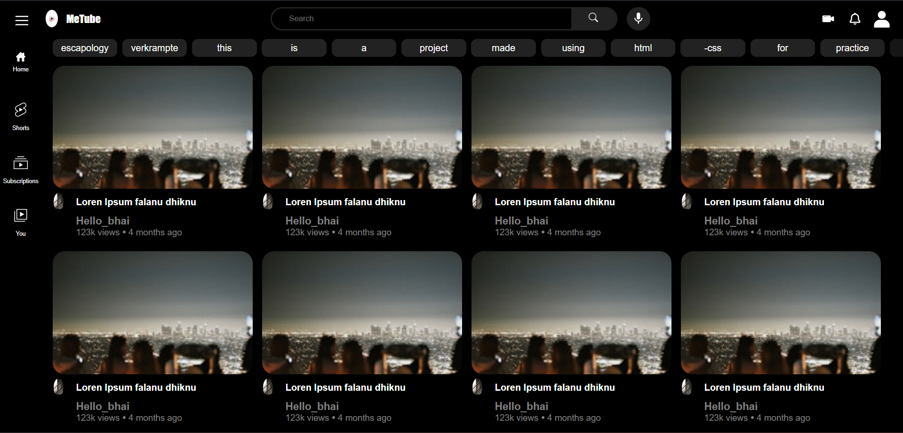

# Youtube clone => Metube using HTML-CSS

This contains a youtube homepage made from pure html css. This includes the usage of css grid and flexbox concepts. 

## Demo Image

## Authors

- [@Aditya Dave](https://github.com/Adi-Dave-cs)